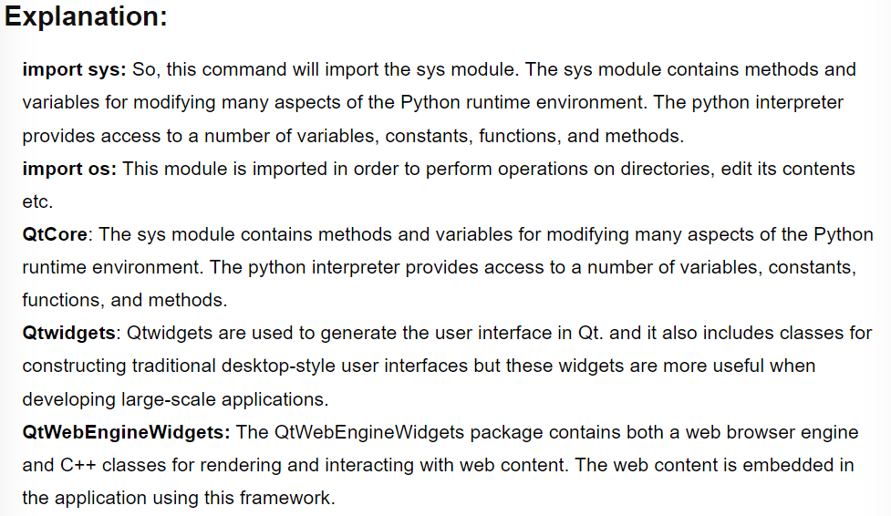
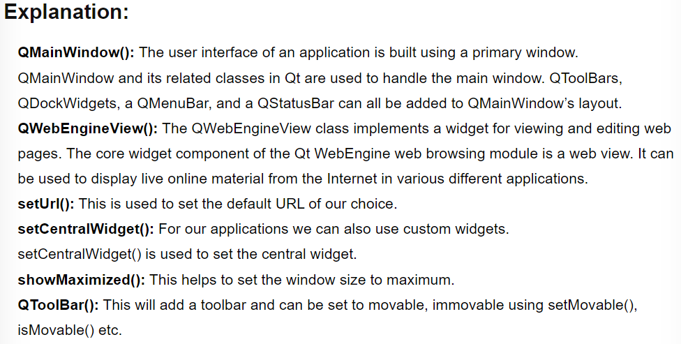
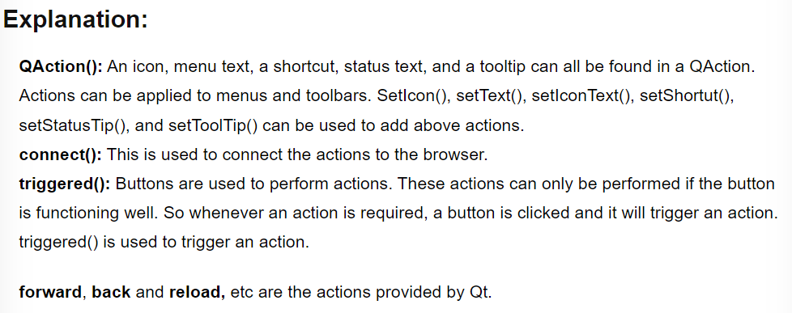
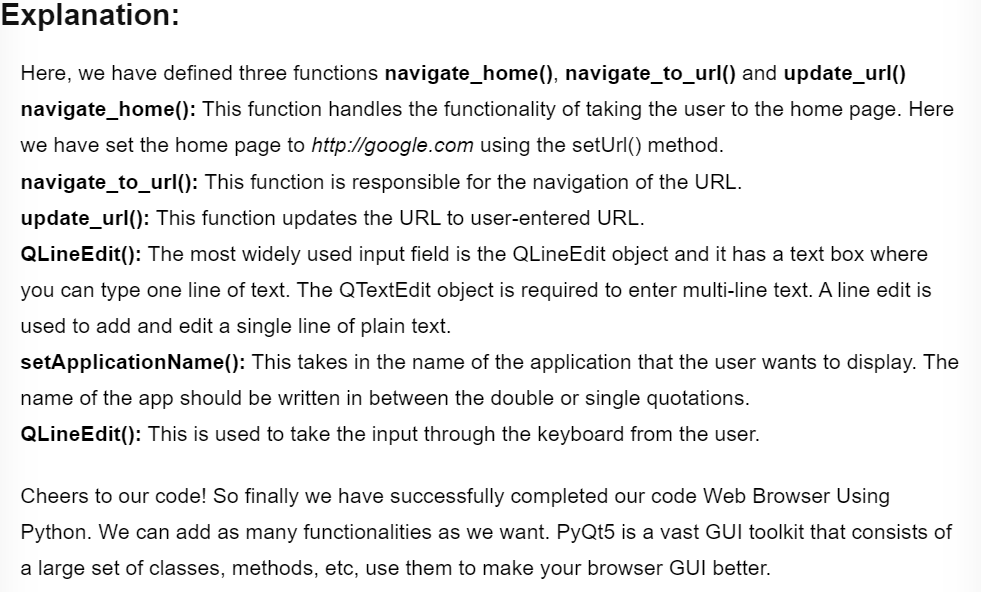

# Python Web Browser

## Tools required


<hr>

## About the project

> Who does not use a browser these days? Everyone does. Creating a browser with a lot of utility is a bit time taking and difficult in the real world, but what if today in this repo we will Create Your Own Web Browser Using Python.

<hr>

#### Before starting with the coding of Web Browser Using Python, let us clear the difference between the two widely used words Browser and Search Engine:

`Browser`

> A web browser is an application that allows you to access information on the Internet. Web browser helps to assist users in having an interactive online session on the World Wide Web/Internet. Example: Chrome, Firefox, etc.

`Search Engine`

> It is a program that is used to locate specific websites on the Internet. It basically aids the user in obtaining knowledge about anything available on the internet.
> Example: Google, Bing, etc.

<hr>

## Browser Features:

- Home Button: This button must-have capability to take the user directly to the home page.
- Forward Button: This button will take the user to the next site.
- Back Button: This button will take the user to previously visited websites.
- Refresh Button: It will have the capability to refresh the content of the site.

## Steps for Developing Web Browser Using Python:

1. Installing the required libraries.

   - PyQt5 and PyQtWebEngine

2. Import the modules that are needed for the development of this project.

   - `sys module, modules from PyQt5 like QtCore, QtWidgets, QtWebEngineWidgets`

3. Functions definition and creation of classes.

4. Coding for buttons and their functionalities.

## Getting Started:

### Step 1: About Libraries & Its Installtion:

`PyQTt5`

> PyQt5 is one of the most popular Python modules for creating graphical user interfaces as it is very easy to use for beginners. The PyQt5 designer makes it so easy to construct complex GUI programs in a short amount of time, and it is also another wonderful feature that motivates developers to choose PyQt5.

`PyQtWebEngine`

> The framework is built on the Chrome browser and allows users to embed online content in their apps. The bindings are built on top of PyQt5 and are divided into three modules that match the framework’s various libraries.

<br>

#### To install the PyQt5 library, enter the following command in the cmd:

```cmd
pip install PyQt5 / pip3 install PyQt5
```

#### To install the PyQtWebEngine library, enter the following command in the cmd:

```cmd
pip install PyQtWebEngine / pip3 install PyQtWebEngine
```

### Step 2: Importing required modules:

```Python
import sys
from PyQt5.QtCore import *
from PyQt5.QtWidgets import *
from PyQt5.QtWebEngineWidgets import *
```



### Step 3: Functions definition and creation of classes:

```Python
class MainWindow(QMainWindow):
    def __init__(self):
        super(MainWindow, self).__init__()
        self.browser = QWebEngineView()
        self.browser.setUrl(QUrl('https://google.com'))
        self.setCentralWidget(self.browser)
        self.showMaximized()
```



### Step 4: Coding for buttons and their functionalities

```Python
navbar = QToolBar()
        self.addToolBar(navbar)

        back_btn = QAction('Back', self)
        back_btn.triggered.connect(self.browser.back)
        navbar.addAction(back_btn)

        forward_btn = QAction('Forward', self)
        forward_btn.triggered.connect(self.browser.forward)
        navbar.addAction(forward_btn)

        reload_btn = QAction('Reload', self)
        reload_btn.triggered.connect(self.browser.reload)
        navbar.addAction(reload_btn)

        home_btn = QAction('Home', self)
        home_btn.triggered.connect(self.navigate_home)
        navbar.addAction(home_btn)
```



```Python
self.url_bar = QLineEdit()
self.url_bar.returnPressed.connect(self.navigate_to_url)
navbar.addWidget(self.url_bar)

self.browser.urlChanged.connect(self.update_url)

    def navigate_home(self):
        self.browser.setUrl(QUrl('https://google.com'))

    def navigate_to_url(self):
        url = self.url_bar.text()
        self.browser.setUrl(QUrl(url))

    def update_url(self, q):
        self.url_bar.setText(q.toString())


app = QApplication(sys.argv)
QApplication.setApplicationName('Copy Assignments Browser')
window = MainWindow()
app.exec_()
```



<hr>

> Yay!! The alarm clock is ready for execution for your next work nap 😉. Save the source code with main.py and run the file: `python3 main.py`
